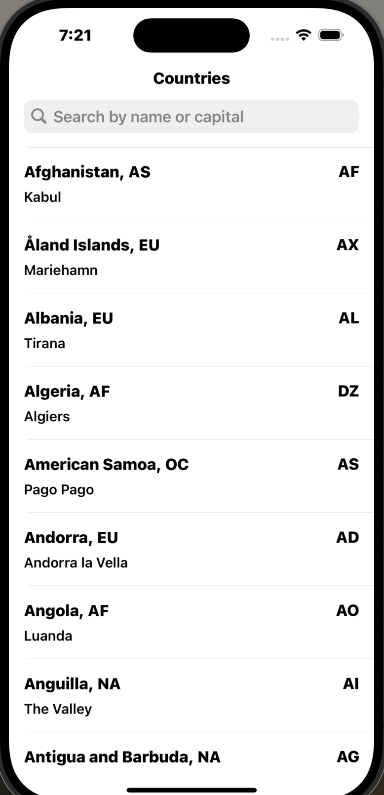

# 🌍 CountriesApp

A modern iOS application showcasing detailed information about countries from around the world, built with best practices and solid architecture principles.



---

## 📝 Project Overview

CountriesApp is a UIKit-based iOS application that demonstrates how to build a robust, scalable mobile application following MVVM architecture, SOLID principles, and modern Swift practices. The app fetches countries data from a remote API and presents it in a user-friendly interface with search capabilities.

### ✨ Features
- View a list of countries with their names, regions, codes, and capitals
- Search/filter countries by name or capital
- Support for iPhone and iPad
- Dynamic Type support for accessibility
- Support for device rotation
- Error handling with user-friendly feedback
- Robust architecture for scalability and maintainability

## 🏗️ Architecture

The project follows the MVVM (Model-View-ViewModel) architecture pattern with clear separation of concerns:

### 📂 Project Structure
```
CountriesApp/
├── CountriesApp/
│   ├── AppDelegate.swift
│   ├── SceneDelegate.swift
│   ├── Info.plist
│   ├── Main/
│   ├── Assets/
│   ├── LaunchScreen/
│   ├── Core/
│   │   ├── Extensions/
│   │   └── Networking/
│   ├── Domain/
│   │   ├── Models/
│   │   └── Services/
│   ├── Presentation/
│   │   └── CountriesList/
│   │       ├── Coordinator/
│   │       ├── ViewModels/
│   │       └── Views/
├── CountriesAppTests/
├── CountriesAppUITests/
└── README.md
```

### 🤩 Key Components

#### Networking Layer
- Protocol-based networking with clear error handling
- Async/await implementation for modern concurrency
- Mock network service for testing

#### Models
- Clean, simple data models
- Extensions for additional functionality
- Search capability built-in

#### ViewModels
- State management using Combine
- Clear interfaces with protocols
- Separation of filtering and data loading logic

#### Views
- Dynamic cell layouts with Auto Layout
- Support for Dynamic Type
- UISearchController integration
- Proper error presentation

#### Coordinator Pattern
- Navigation management with coordinators
- Decoupled screen flows
- Child coordinator support

## 🔍 Design Patterns & Principles

- **SOLID Principles**: Each component has a single responsibility, dependencies are abstracted through interfaces, etc.
- **Dependency Injection**: All dependencies are injected through initializers for better testability
- **Protocol-Oriented Programming**: Interfaces defined through protocols
- **Combine Framework**: Reactive programming for state management
- **Modern Concurrency**: Using Swift's async/await for better readability and performance

## 🧺as Testing

The project includes unit tests for key components:
- NetworkService tests
- ViewModel tests
- Filter functionality tests

## 🚀 Getting Started

### Requirements
- Xcode 15.0+
- iOS 16.0+
- Swift 5.9+

### Installation
1. Clone the repository
```bash
git clone https://github.com/toto1949/CountriesApp.git
```

2. Open the project in Xcode
```bash
cd CountriesApp
open CountriesApp.xcodeproj
```

3. Build and run the application

## 📱 Demo

[View Demo Video](https://drive.google.com/file/d/1fHNK5Cgkjld310XEEnF49gmIWy8Os5gz/view?usp=drive_link)

## 📚 Best Practices Applied

- **Error Handling**: Comprehensive error handling throughout the app
- **Memory Management**: Proper use of weak references to avoid retain cycles
- **Accessibility**: Dynamic Type support and correct VoiceOver properties
- **iPad Support**: Responsive layouts for all screen sizes
- **Code Documentation**: Clear comments and documentation
- **Modern Swift**: Usage of Swift's latest features
- **Performance**: Efficient table view cell reuse and data loading

## 📄 License

This project is licensed under the MIT License - see the LICENSE file for details.


